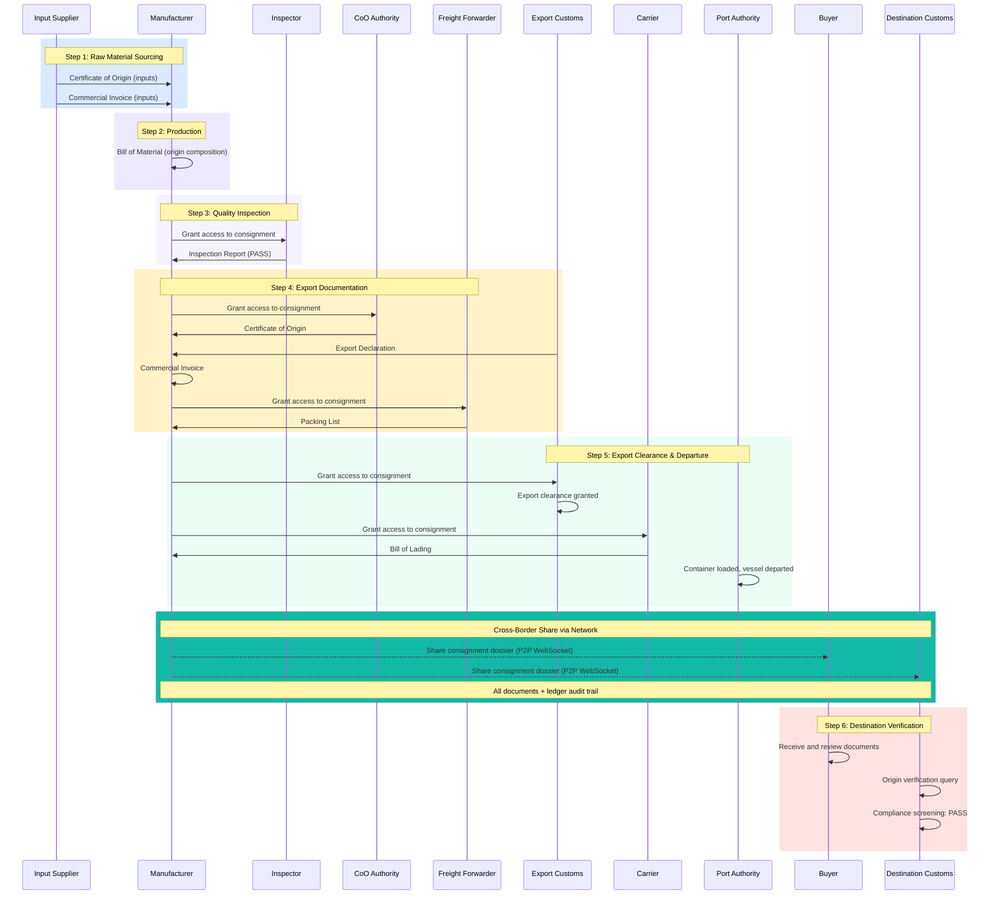

# Trade Corridor Demo Guide

**For:** Live demo presentations to stakeholders
**Prerequisites:** Node.js 18+, npm installed

> This guide uses the **Vietnam-US corridor** (`configs/vietnam-us.json`) as the primary example. The same walkthrough applies to any corridor config — organisations, documents, and credentials adapt automatically.

---

## Quick Start

### Local (Node.js)

```bash
npm install
npm run demo
```

Three processes start automatically:
- **Node Alpha** (Export): http://localhost:4000
- **Node Beta** (Import): http://localhost:4001
- **Proxy** (single URL): http://localhost:4002

Via proxy, use `?node=alpha` or `?node=beta` to switch:
- http://localhost:4002/?node=alpha
- http://localhost:4002/?node=beta

### Switching corridors

```bash
CONFIG_FILE=configs/adapt-africa.json npm run demo
```

### Docker

```bash
docker compose up --build
```

Same three services on the same ports (4000, 4001, 4002).

All consignments and documents are **pre-loaded**. No uploads or data entry required.

---

## Login Credentials

All passwords are `demo`. Organisations are defined in the active corridor config.

### Example: Vietnam-US corridor

#### Node Alpha (http://localhost:4000)

| Username | Organization | Role |
|----------|-------------|------|
| `tng` | TNG Investment & Trading JSC | Manufacturer |
| `moit` | Ministry of Industry and Trade | Certificate of Origin Authority |
| `vncustoms` | General Department of Vietnam Customs | Customs Authority |
| `hyosung` | Hyosung TNS Co., Ltd | Input Supplier (Korea) |
| `bvinspector` | Bureau Veritas Vietnam | Quality Inspector |
| `catlaiport` | Cat Lai Port Authority | Port Authority |
| `gemadept` | Gemadept Logistics | Freight Forwarder |
| `maersk` | Maersk Vietnam | Carrier |
| `financier1` | Vietcombank | Advising Bank |
| `financier2` | HSBC Vietnam | International Bank |

#### Node Beta (http://localhost:4001)

| Username | Organization | Role |
|----------|-------------|------|
| `nike` | Nike Inc. | Importing Buyer (US) |
| `nikeeu` | Nike Europe B.V. | Importing Buyer (EU) |
| `uscbp` | US Customs and Border Protection | US Customs |
| `eucustoms` | EU Customs (Netherlands) | EU Customs |

---

## The User Journey

The following sequence diagram reflects the generic trade corridor flow. Specific actors depend on the active config.



---

## Main Demo: Pre-Loaded Walkthrough

All consignments and documents are pre-seeded from the active config. The first consignment has all documents attached and permissions pre-configured.

### Part 1: Export Side

1. Open http://localhost:4000
2. Login as the manufacturer (e.g. `tng` / `demo` for Vietnam)
3. **Dashboard**: show trade volume, active consignments, recent activity
4. **Consignments**: click on the first consignment
5. Walk through the pre-loaded documents, explaining each step of the journey
6. **Permissions**: show who can see what (owner-controlled access)

### Part 2: Connect Nodes

7. Go to **Network** page
8. Click **Connect** to Beta node
9. Wait for green status (peer organisations discovered)

### Part 3: Cross-Border Share

10. Go back to **Consignments**
11. On the first consignment, click **Share**
12. Select the buyer and destination customs as recipients
13. All documents and the audit trail sync to Node Beta in real time

**Talking point:** "With one click, the entire verified dossier travels securely to the destination. The buyer and customs receive the same immutable records that were built step by step in the export country."

### Part 4: Destination Verification

14. Open http://localhost:4001
15. Login as destination customs (e.g. `uscbp` / `demo` for Vietnam-US)
16. Go to **Consignments**, open the received consignment
17. Walk through all documents (identical to what was on Alpha)
18. Go to **Analytics**: show the complete audit trail with hashes and timestamps

**Talking point:** "Customs can now verify the entire chain of custody. Every document is linked to a verified digital identity. The origin composition is transparent and auditable."

---

## Additional Demos

### Digital Identity

1. Login as the manufacturer on Alpha
2. Go to **Identity** page
3. Click **Register** on the manufacturer's card
4. Enter a valid registration number (see config for valid codes)
5. Watch the 5-step verification animation
6. The organisation gets a DID: `did:iota:0x...`

Test codes that pass or fail are defined in the corridor config under `credentials.blacklisted`, `credentials.expired`, `credentials.suspended`.

### Trade Finance

1. Login as the manufacturer on Alpha, go to **Trade Finance**
2. **Letters of Credit** tab: view the pre-seeded LC
3. **Smart Contracts** tab: view the release conditions
4. Click **Verify** on each unmet condition
5. When all conditions are met, payment auto-releases

**Talking point:** "The smart contract ties payment release directly to origin verification. When the system confirms compliant origin composition and customs clearance, the payment releases automatically."

### Error Cases

The demo includes pre-seeded error consignments that demonstrate:
- **HS Code Mismatch**: Declaration and invoice declare different HS codes
- **Origin Verification Failed**: Origin composition below threshold, compliance screening flags

### Analytics

1. Go to **Analytics** (Ledger Explorer) on either node
2. Filter by event type: identity, document, permission, network, finance
3. Each entry shows: timestamp, actor, action, SHA-256 hash

---

## Which Demo to Run

| Duration | What to show |
|----------|-------------|
| 5 min | Main Demo (Parts 1-4) |
| 10 min | Main Demo + Error Cases |
| 15 min | Main Demo + Trade Finance + Error Cases |
| 30 min | Main Demo + all Additional Demos |

---

## Common Questions

**"Where is the data stored?"**
Each node stores data in memory. Trade documents stay with the data owner. Only cryptographic hashes go on the distributed ledger. The demo resets on restart.

**"How does this work with real government systems?"**
In the demo, government authorities are separate logins. In production, the platform connects via adapters to real government APIs.

**"Is this on the real IOTA blockchain?"**
The demo simulates the DLT layer locally. In production, ledger entries are anchored on IOTA Mainnet with real cryptographic proofs.

**"What about data sovereignty?"**
Export-side data stays on Node Alpha. Only what the owner explicitly shares crosses to Node Beta. Permissions are owner-controlled.

**"Why two nodes?"**
Each country operates its own node. Cross-border exchange happens via P2P WebSocket (simulating the Data Space Connector protocol). No central server sees all data.

**"Can this work for other corridors?"**
Yes. The platform is corridor-agnostic. Change the `CONFIG_FILE` environment variable to point to a different corridor config and restart.

---

## Troubleshooting

| Issue | Solution |
|-------|----------|
| Port in use | `lsof -ti:4000 \| xargs kill` |
| Node connection fails | Ensure both nodes are running (`npm run dev` starts both) |
| Documents not showing | Grant permission first (Permissions page) |
| Ledger not syncing | Connect nodes via Network page before sharing |
| Login fails | All passwords are `demo` |
