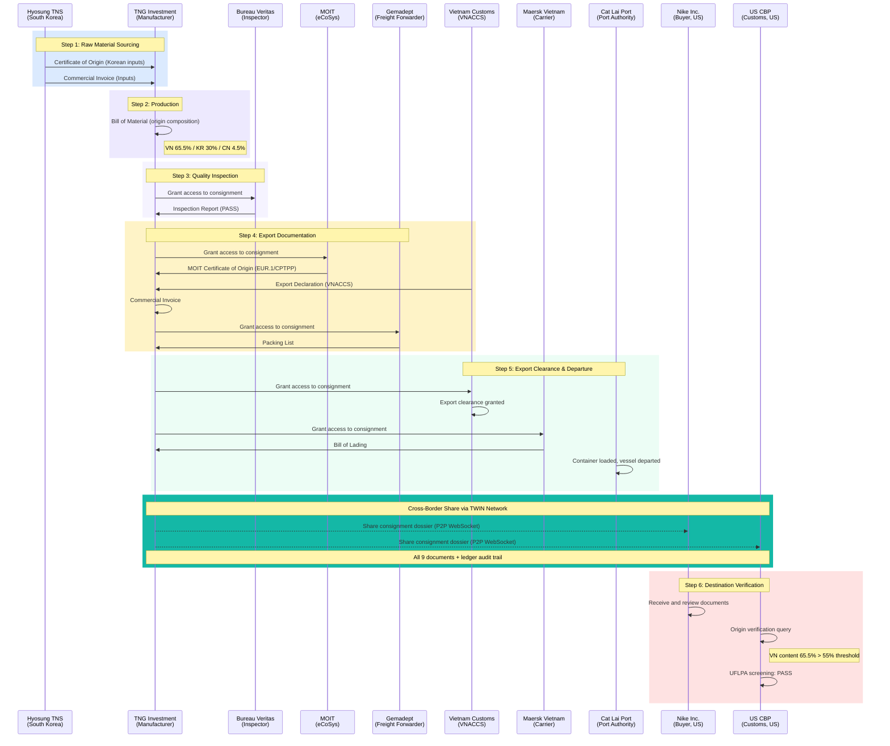

# TWIN Vietnam Demo Guide

**For:** Live demo presentations to MOIT, TBI, IOTA, and stakeholders
**Prerequisites:** Node.js 18+, npm installed

---

## Quick Start

### Local (Node.js)

```bash
npm install
npm run demo
```

Three processes start automatically:
- **Node Alpha** (Vietnam Export): http://localhost:4000
- **Node Beta** (US/EU Import): http://localhost:4001
- **Proxy** (single URL): http://localhost:4002

Via proxy, use `?node=alpha` or `?node=beta` to switch:
- http://localhost:4002/?node=alpha
- http://localhost:4002/?node=beta

### Docker

```bash
docker compose up --build
```

Same three services on the same ports (4000, 4001, 4002).

All consignments and documents are **pre-loaded**. No uploads or data entry required.

---

## Login Credentials

All passwords are `demo`.

### Node Alpha (http://localhost:4000)

| Username | Organization | Role |
|----------|-------------|------|
| `tng` | TNG Investment & Trading JSC | Manufacturer |
| `moit` | Ministry of Industry and Trade | Certificate of Origin Authority |
| `vncustoms` | General Department of Vietnam Customs | Customs Authority |
| `hyosung` | Hyosung TNS Co., Ltd | Input Supplier (Korea) |
| `bvinspector` | Bureau Veritas Vietnam | Quality Inspector |
| `catlaiport` | Cat Lai Port Authority | Port Authority |
| `gemadept` | Gemadept Logistics | Freight Forwarder |
| `maersk` | Maersk Vietnam | Carrier |
| `financier1` | Vietcombank | Advising Bank |
| `financier2` | HSBC Vietnam | International Bank |

### Node Beta (http://localhost:4001)

| Username | Organization | Role |
|----------|-------------|------|
| `nike` | Nike Inc. | Importing Buyer (US) |
| `nikeeu` | Nike Europe B.V. | Importing Buyer (EU) |
| `uscbp` | US Customs and Border Protection | US Customs |
| `eucustoms` | EU Customs (Netherlands) | EU Customs |

---

## The User Journey



---

## Main Demo: Pre-Loaded Walkthrough

All consignments and documents are pre-seeded. The first consignment (`VN-2026-EXP-00101`: polo shirts to Nike US) has all 9 documents attached and permissions pre-configured.

### Part 1: Vietnam Export Side

1. Open http://localhost:4000
2. Login as `tng` / `demo`
3. **Dashboard**: show trade volume, active consignments, recent activity
4. **Consignments**: click on `VN-2026-EXP-00101`
5. Walk through the 9 pre-loaded documents, explaining each step of the journey:

| Document | Issuer | Explains |
|----------|--------|----------|
| Commercial Invoice (Inputs) | Hyosung TNS Co., Ltd | Korean fabric sourcing |
| Input Certificate of Origin | Korea Customs Service | CPTPP cumulation proof |
| Bill of Material | TNG Investment & Trading JSC | Origin composition: VN 65.5%, KR 30%, CN 4.5% |
| Inspection Report | Bureau Veritas Vietnam | Independent quality verification |
| MOIT Certificate of Origin | Ministry of Industry and Trade | Electronic CO via eCoSys |
| Export Declaration | General Department of Vietnam Customs | VNACCS clearance |
| Commercial Invoice | TNG Investment & Trading JSC | Final export invoice |
| Packing List | Gemadept Logistics | Freight details |
| Bill of Lading | Maersk Vietnam | Carrier transport document |

6. **Permissions**: show who can see what (owner-controlled access)

### Part 2: Connect Nodes

7. Go to **Network** page
8. Click **Connect** to Beta node
9. Wait for green status (peer organizations discovered: Nike, CBP, EU Customs)

### Part 3: Cross-Border Share

10. Go back to **Consignments**
11. On `VN-2026-EXP-00101`, click **Share**
12. Select **Nike Inc.** and **US CBP** as recipients
13. All documents and the audit trail sync to Node Beta in real time

**Talking point:** "With one click, the entire verified dossier travels securely to the destination. Nike and US CBP receive the same immutable records that were built step by step in Vietnam."

### Part 4: Destination Verification

14. Open http://localhost:4001
15. Login as `uscbp` / `demo`
16. Go to **Consignments**, open the received consignment
17. Walk through all documents (identical to what was on Alpha)
18. Go to **Analytics**: show the complete audit trail with hashes and timestamps

**Talking point:** "CBP can now verify the entire chain of custody. Every document is linked to a verified digital identity. The origin composition shows 65.5% Vietnamese content. The Korean fabric is CPTPP-eligible. No Xinjiang-origin materials."

---

## Additional Demos

### Digital Identity (~3 min)

1. Login as `tng` on Alpha
2. Go to **Identity** page
3. Click **Register** on TNG's card
4. Enter: `MST-0102030405` (Vietnamese tax code)
5. Watch the 5-step verification animation
6. TNG gets a DID: `did:iota:0x...`

Test codes that pass: `MST-0102030405`, `KBN-1234567890`, `EIN-12-3456789`, `EORI-DE123456`
Test codes that fail: `MST-000000` (blacklisted), `MST-111111` (expired), `MST-222222` (suspended)

### Trade Finance (~5 min)

1. Login as `tng` on Alpha, go to **Trade Finance**
2. **Letters of Credit** tab: view `LC-2026-VCB-0101` ($168,000 USD, Confirmed)
   - Show the document compliance checklist
3. **Smart Contracts** tab: view `SC-2026-VN-0101`
   - Show 4 release conditions (MOIT CoO, origin %, B/L, CBP pre-clearance)
   - Click **Verify** on each unmet condition
   - When all conditions are met, payment auto-releases

**Talking point:** "The smart contract ties payment release directly to origin verification. When TWIN confirms Vietnamese content exceeds 55% and CBP has no UFLPA hold, the payment releases automatically."

### Error Cases (~3 min)

**HS Code Mismatch** (`VN-2026-EXP-E001`):
- Export Declaration says HS 6205.30 (man-made fibres) but Commercial Invoice declares HS 6205.20 (cotton)
- TWIN catches this before export

**Origin Verification Failed** (`VN-2026-EXP-E002`):
- Origin composition shows only 38% Vietnamese content (below 40% threshold)
- UFLPA screening flag on fleece supplier
- The brand avoids tariff liability and reputational risk

### Analytics (~2 min)

1. Go to **Analytics** (Tangle Explorer) on either node
2. Filter by event type: CONSIGNMENT, DOCUMENT, LOGISTICS, PERMISSION, IDENTITY, PAYMENT, CONTRACT
3. Each entry shows: timestamp, actor, action, SHA-256 hash

---

## Which Demo to Run

| Duration | What to show |
|----------|-------------|
| 5 min | Main Demo (Parts 1-4) |
| 10 min | Main Demo + Error Cases |
| 15 min | Main Demo + Trade Finance + Error Cases |
| 30 min | Main Demo + all Additional Demos |

| Audience | Emphasize |
|----------|-----------|
| **MOIT officials** | eCoSys integration in Main Demo, Digital Identity |
| **Customs** | Error Cases, Analytics, cross-border verification |
| **Brands (Nike)** | Main Demo (destination side), Error Cases |
| **Financiers** | Trade Finance, Main Demo |

---

## Common Questions

**"Where is the data stored?"**
Each node stores data in memory. Trade documents stay with the data owner. Only cryptographic hashes go on the distributed ledger. The demo resets on restart.

**"How does this integrate with eCoSys/VNACCS?"**
In the demo, MOIT and Customs are separate logins. In production, TWIN connects via adapters to eCoSys and VNACCS APIs.

**"Is this on the real IOTA blockchain?"**
The demo simulates the DLT layer locally. In production, ledger entries are anchored on the IOTA DLT with real cryptographic proofs.

**"What about data sovereignty?"**
Vietnam's data stays on Node Alpha. Only what the owner explicitly shares crosses to Node Beta. Permissions are owner-controlled.

**"Why two nodes?"**
Each country operates its own TWIN node. Cross-border exchange happens via P2P WebSocket (simulating the Data Space Connector protocol). No central server sees all data.

---

## Troubleshooting

| Issue | Solution |
|-------|----------|
| Port in use | `lsof -ti:4000 | xargs kill` |
| Node connection fails | Ensure both nodes are running (`npm run dev` starts both) |
| Documents not showing | Grant permission first (Permissions page) |
| Tangle not syncing | Connect nodes via Network page before sharing |
| Login fails | All passwords are `demo` |
