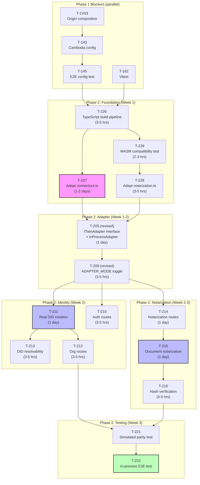

# ADR-001: TWIN Integration Strategy for Phase 2

**Status:** Proposed
**Date:** 2026-05-19
**Author:** Solution Architect (KChain Solutions)
**Stakeholders:** Valerio Mellini (Founder), TWIN Foundation team, MOIT stakeholders

---

## 1. Context

The moit-demo is a corridor-agnostic trade corridor simulation for Vietnam garment exports. Phase 1 is substantially complete (48/62 tasks): config-driven corridors, mobile responsiveness, modular server architecture. Phase 2 must replace simulated blockchain operations with real IOTA testnet operations (DIDs, notarization, credential verification) to demonstrate production viability to MOIT stakeholders.

### Business constraints

- **Audience:** Vietnamese Ministry of Industry and Trade (MOIT) officials and garment industry stakeholders. They care about visible proof that documents are tamper-proof and verifiable on a real ledger. They do not care about infrastructure topology.
- **Timeline:** The demo must reach a "wow moment" (real DID on IOTA Explorer, real on-chain notarization with verifiable hash) as fast as possible. Every week of delay is a week where competitors can show something similar.
- **Team:** One developer (Valerio) with deep IOTA familiarity. No dedicated DevOps capacity for managing Docker containers, MySQL databases, and multi-service orchestration.
- **Deployment target:** The demo must run reliably during stakeholder presentations. Crashes, timeouts, or Docker networking failures during a live demo are unacceptable.
- **Current server:** Plain Node.js/Express (no TypeScript), modular route structure in `server/routes/*.js`. Adding TypeScript and WASM dependencies is straightforward but requires careful integration.

### Critical architectural finding

Analysis of the `twin-etd-poc` codebase (TWIN Foundation's own Electronic Trade Documents proof-of-concept) revealed that it does NOT connect to a remote TWIN Node. Instead, it imports the TWIN connector stack directly as npm packages and runs everything in-process:

| Component | Package | Purpose |
|-----------|---------|---------|
| Vault | `@twin.org/vault-connector-entity-storage` | BIP-39 mnemonic storage |
| Wallet | `@twin.org/wallet-connector-iota` | IOTA wallet operations, faucet auto-funding |
| Identity | `@twin.org/identity-connector-iota` | Real DID creation/resolution on-chain |
| NFT | `@twin.org/nft-connector-iota` | Move contract deployment, NFT mint/transfer/burn |
| Notarization | `@iota/notarization` (WASM) | Locked notarization proof-of-existence |
| Interaction | `@iota/iota-interaction-ts` (WASM) | Ed25519 signer for notarization |

The `setupTwinConnectors.ts` file (714 lines) is a self-contained initialization module that:
1. Registers vault, wallet, identity, and NFT connectors via factory pattern
2. Creates per-party identities with unique mnemonics, funded wallets, and on-chain DIDs
3. Provides `createDid()`, `resolveDid()`, `createProofForDid()`, `verifyProofForDid()` as simple function calls
4. Persists NFT deployment state to `.data/` directory

The `iotaNotarizationHelper.ts` (191 lines) provides `createLockedNotarization()` and `verifyNotarization()` with retry logic.

Both files are production-quality code written by the TWIN Foundation team (Alberto Oliveri, IOTA Stiftung). They represent the officially sanctioned pattern for direct IOTA integration.

---

## 2. Options Evaluated

### Option A: Remote TWIN Node (Original Plan)

Deploy two TWIN Node Docker containers (Alpha :3000, Beta :3001), each with MySQL, and build a REST client wrapper in the moit-demo server to call the TWIN Node HTTP API.

**Architecture:**
```
moit-demo Server Alpha (:4000)  --HTTP-->  TWIN Node Alpha (:3000)  --RPC-->  IOTA Testnet
                                            |-- MySQL
                                            |-- Blob Storage
moit-demo Server Beta  (:4001)  --HTTP-->  TWIN Node Beta  (:3001)  --RPC-->  IOTA Testnet
                                            |-- MySQL
                                            |-- Blob Storage
```

**Pros:**
- Matches the eventual production architecture (managed TWIN Nodes)
- Exercises the full TWIN Node REST API surface (authentication, sessions, RBAC)
- Tests DSP readiness (TWIN Node has built-in DSP support for Phase 3)

**Cons:**
- **Heavy infrastructure:** Each TWIN Node requires Docker, MySQL 8.4, ~512MB RAM, port configuration, health monitoring. Two nodes = 4+ Docker containers (2 TWIN, 2 MySQL), network bridging, volume mounts.
- **Dependency on T-201:** Cannot start until Docker image access is confirmed with the TWIN team. This is an external dependency with uncertain lead time.
- **JWT middleware complexity:** T-207 requires mapping the demo's simple auth model to TWIN Node's JWT session management, cookie forwarding, and token refresh.
- **REST client surface:** T-206 maps 9+ endpoints. Each requires error handling, retry logic, and response transformation. The TWIN Node API is evolving (`0.0.3-next.37`), so these mappings are fragile.
- **Demo fragility:** Docker networking issues, MySQL startup delays, or TWIN Node crashes during a live demo are catastrophic. Debugging requires knowledge of Docker Compose, container logs, and TWIN Node internals.
- **Estimated calendar time to first real DID:** 3-4 weeks (T-201 > T-202/T-203 > T-204 > T-206 > T-207 > T-210 > T-211).

### Option B: In-Process Connectors (twin-etd-poc Pattern)

Import TWIN connector packages directly into the moit-demo server as npm dependencies. Adapt `setupTwinConnectors.ts` and `iotaNotarizationHelper.ts` from the twin-etd-poc. No external TWIN Node process needed.

**Architecture:**
```
moit-demo Server Alpha (:4000)  --RPC (in-process)-->  IOTA Testnet
  |-- @twin.org/identity-connector-iota
  |-- @twin.org/wallet-connector-iota
  |-- @iota/notarization (WASM)
  |-- .data/ (file-based entity storage)

moit-demo Server Beta  (:4001)  --RPC (in-process)-->  IOTA Testnet
  |-- (same packages, different mnemonic)
  |-- .data/ (separate data dir)
```

**Pros:**
- **Fastest path to real DID:** Estimated 3-5 days from start to first real `did:iota:testnet:0x...` in the demo. No Docker, no external dependencies, no image access requests.
- **Battle-tested code:** `setupTwinConnectors.ts` and `iotaNotarizationHelper.ts` are IOTA Foundation code from a working PoC. Copy-adapt, not build-from-scratch.
- **Minimal infrastructure:** Single Node.js process per node. File-based entity storage (`.data/` JSON files). No Docker, no MySQL, no container orchestration.
- **Demo resilience:** One process to start, one process to debug. If it crashes, `npm run demo` restarts in seconds. No Docker Compose dependency chains.
- **Full feature coverage:** Identity (DID creation, resolution, verification methods), notarization (locked notarization, verification), NFT operations (mint, transfer, burn), cryptographic proofs (Ed25519 DataIntegrityProof).

**Cons:**
- **TypeScript introduction:** The moit-demo server is plain JS. The TWIN connector code is TypeScript. Requires either converting the relevant server modules to TypeScript or creating a TypeScript adapter compiled separately.
- **WASM compatibility risk:** `@iota/notarization` and `@iota/iota-interaction-ts` use WASM bindings. These have known quirks (e.g., `getChainIdentifier()` monkey-patch in `iotaNotarizationHelper.ts`). Platform-specific issues (macOS ARM vs Linux x64) are possible.
- **Package version churn:** TWIN packages are on `next` channel (pre-release). Breaking changes between versions are likely.
- **No DSP path:** In-process connectors do not provide DSP protocol support. Phase 3's cross-border data exchange still requires a full TWIN Node.
- **Divergence from production:** The demo would not exercise the TWIN Node REST API, JWT sessions, or managed infrastructure patterns that production deployments will use.

### Option C: Hybrid (Recommended)

Use in-process connectors for Phase 2 demo, but structure the code behind an adapter interface that makes the eventual swap to a TWIN Node REST client transparent.

**Architecture:**
```
moit-demo Server Alpha (:4000)
  |-- server/adapter/index.js          <-- ADAPTER_MODE switch
  |     |-- adapter/simulated.js       <-- Current demo logic (no change)
  |     |-- adapter/in-process.js      <-- TWIN connectors via npm packages
  |     |-- adapter/twin-node.js       <-- (Phase 3) REST client to TWIN Node
  |
  |-- server/twin/                     <-- Extracted from twin-etd-poc
  |     |-- connectors.ts             <-- Adapted setupTwinConnectors.ts
  |     |-- notarization.ts           <-- Adapted iotaNotarizationHelper.ts
  |     |-- types.ts                  <-- IPartyIdentity, shared types
  |
  |-- .data/                           <-- File-based entity storage

ADAPTER_MODE=simulated   --> Current demo behavior (zero dependencies)
ADAPTER_MODE=in-process  --> Real IOTA ops via npm packages (Phase 2)
ADAPTER_MODE=twin-node   --> REST client to deployed TWIN Node (Phase 3+)
```

**Pros:**
- **Speed of B, path of A.** Gets real IOTA operations running in days, not weeks. The adapter interface ensures that swapping to a TWIN Node REST client in Phase 3 requires changing only one adapter implementation, not rewiring the entire server.
- **Progressive complexity.** Phase 2 demos use `ADAPTER_MODE=in-process`. Phase 3 introduces `ADAPTER_MODE=twin-node` when DSP is needed and Docker infrastructure is available.
- **Testability.** `ADAPTER_MODE=simulated` remains for offline development, CI/CD, and presentations without network access. No regression risk.
- **Validated architecture.** The adapter pattern is exactly what the TWIN whitepaper recommends for system integration (external adaptor, in-node adaptor, or hybrid). We are implementing an external adaptor that starts in-process and graduates to remote.

**Cons:**
- All of Option B's cons (TypeScript, WASM, package churn) still apply for Phase 2.
- Slightly more upfront design work for the adapter interface compared to a direct integration.
- The `twin-node` adapter mode will not be implemented in Phase 2, creating a planned TODO.

---

## 3. Decision

**Adopt Option C: Hybrid approach with in-process connectors behind an adapter interface.**

### Rationale

1. **Business immediacy wins.** The demo needs to show real DIDs and real notarization to MOIT stakeholders. Every layer of indirection (Docker, JWT, REST client, MySQL) between the demo server and the IOTA ledger is a layer that can fail during a live presentation and a layer that takes a week to debug. The in-process pattern eliminates all of them.

2. **Proven code, not speculative integration.** The `twin-etd-poc` code is authored by the TWIN Foundation team. It is the same codebase they use for their own demos. Adapting 900 lines of tested, working code is lower risk than building a 9-endpoint REST client wrapper against a pre-release API.

3. **The adapter interface preserves optionality.** By defining a clean `ITwinAdapter` interface (createDid, resolveDid, createNotarization, verifyNotarization), the Phase 3 swap to a TWIN Node REST client becomes a single file replacement. The demo server routes do not change, the frontend does not change, the test suite does not change.

4. **IOTA is NOT feeless.** The in-process pattern uses the faucet connector for automatic testnet funding (`ensureBalance()`). This is simpler than configuring a Gas Station endpoint on a Docker-deployed TWIN Node. For production, Gas Station will be configured at the TWIN Node level, which is Phase 3/4 scope.

5. **Solo developer reality.** Managing Docker Compose with 4+ containers, debugging MySQL initialization, troubleshooting TWIN Node startup failures, and maintaining JWT session forwarding is a significant cognitive load for a one-person team. The in-process approach reduces the surface area to "npm install + npm run demo".

---

## 4. Consequences

### Positive

- **Time to first real DID: ~3-5 days** (vs. 3-4 weeks with Strategy A)
- **Time to first real notarization: ~1 week** (vs. 4-5 weeks with Strategy A)
- **Zero Docker dependency** for Phase 2 demos
- **Simulated mode preserved** as a fallback for offline/CI scenarios
- **Phase 2 task count reduced** from 33 to ~20 (see impact table below)
- **Demo reliability** significantly improved (single process, no network hops)
- **Code reuse** from IOTA Foundation's own PoC reduces implementation risk

### Negative

- **TypeScript build step** added to the moit-demo server (the `server/twin/` directory will be TypeScript compiled to JS)
- **WASM dependency** introduces platform-specific risk (requires testing on macOS ARM and Linux x64)
- **Phase 3 still requires TWIN Node** for DSP protocol support. The TWIN Node integration work is deferred, not eliminated.
- **Divergence narrative:** When presenting to TWIN Foundation team, need to explain why we are not using the TWIN Node directly. Mitigation: frame as "we use the same packages the TWIN Node uses internally, wrapped in an adapter pattern that graduates to the full TWIN Node when DSP is needed."

---

## 5. Phase 2 Task Impact Table

### Eliminated Tasks (9 tasks removed)

| Task | Title | Reason for elimination |
|------|-------|----------------------|
| **T-201** | Request TWIN Node staging/testnet access | No external TWIN Node needed. Direct npm install. |
| **T-202** | Deploy TWIN Node Alpha on testnet | No Docker deployment. In-process connectors. |
| **T-203** | Deploy TWIN Node Beta on testnet | Same as T-202. |
| **T-204** | Fund testnet wallets via IOTA faucet | Auto-handled by `walletConnector.ensureBalance()` in the connector code. |
| **T-206** | Implement TWIN Node REST client wrapper | No REST client needed. Direct function calls. |
| **T-207** | Implement adapter session/JWT middleware | No JWT sessions. Connector uses in-memory controller identities. |
| **T-208** | Error translation layer | Errors are native JS errors, no HTTP-to-HTTP translation needed. |
| **T-224** | Configure Gas Station for testnet | Faucet auto-funding replaces Gas Station for testnet. |
| **T-225** | Evaluate multi-tenant TWIN Node | N/A with in-process approach. |

### Modified Tasks (8 tasks changed)

| Task | Title | Modification |
|------|-------|-------------|
| **T-205** | Scaffold adapter server | **Renamed:** "Create adapter interface and in-process implementation." Define `ITwinAdapter` interface with methods: `init()`, `createDid()`, `resolveDid()`, `createNotarization()`, `verifyNotarization()`, `createProof()`, `verifyProof()`. Implement `InProcessAdapter` using adapted twin-etd-poc code. Dependencies change: no longer depends on T-145 (can start immediately after Phase 1 blockers). |
| **T-209** | ADAPTER_MODE toggle | **Updated modes:** `simulated` (current), `in-process` (new, replaces `real`), `twin-node` (deferred to Phase 3, replaces `entity-storage`). |
| **T-210** | Auth routes | **Simplified:** No TWIN Node auth mapping needed. In `in-process` mode, auth stays as-is (demo login). DID creation happens on first org registration, not on login. |
| **T-211** | Identity routes (real DID) | **Simplified:** Call `adapter.createDid(partyName)` directly. No REST client. The `createDid()` function from twin-etd-poc handles mnemonic generation, wallet funding, DID document creation, and verification method addition. |
| **T-214** | Notarization routes | **Simplified:** Call `adapter.createNotarization(hash, docId, typeCode, issuerDid)` directly. No REST client. |
| **T-215** | Document routes with notarization | **Simplified:** SHA-256 hash > call adapter > store result. No blob storage upload (deferred to Phase 3 with TWIN Node). |
| **T-217** | Consignment routes | **Unchanged scope** but dependencies simplified (no T-206 dependency). Maps demo consignment model to adapter calls for anchoring. |
| **T-221** | Simulated mode parity test | **Unchanged scope.** `ADAPTER_MODE=simulated` must produce identical behavior to current demo. |

### Unchanged Tasks (7 tasks)

| Task | Title | Notes |
|------|-------|-------|
| **T-212** | Org routes | Enriches config orgs with real DID status. Works with adapter. |
| **T-213** | DID resolvability verification | Calls `adapter.resolveDid()`. Explorer URL generation stays. |
| **T-216** | On-chain hash verification | Calls `adapter.verifyNotarization()`. Same acceptance criteria. |
| **T-222** | Real mode E2E test | Renamed scope to "in-process mode E2E test". Same test flow. |
| **T-223** | Frontend status indicators | No change. Frontend receives real DIDs/hashes regardless of backend approach. |
| **T-2V01-07** | Vietnam-specific tasks | No change. Origin composition, eCoSys stub, VNACCS stub, etc. are independent of the backend integration strategy. |

### New Tasks (4 tasks added)

| Task | Title | Priority | Effort | Description |
|------|-------|----------|--------|-------------|
| **T-226** | Add TypeScript build pipeline for server/twin/ | P0 | S | Add `tsx` or `tsc` step for `server/twin/*.ts` files. Configure `tsconfig.json` for ESM output. Add `@twin.org/*` and `@iota/*` packages to moit-demo `package.json`. |
| **T-227** | Adapt setupTwinConnectors from twin-etd-poc | P0 | M | Copy `setupTwinConnectors.ts` to `server/twin/connectors.ts`. Adapt for moit-demo context: remove NFT connector (not needed for Phase 2), remove file-based NFT deployment persistence, simplify to DID + wallet + vault initialization. Create per-org identity on `POST /api/orgs/:id/register`. |
| **T-228** | Adapt notarization helper from twin-etd-poc | P0 | S | Copy `iotaNotarizationHelper.ts` to `server/twin/notarization.ts`. Adapt for moit-demo document model: map `documentId` to demo `docId`, use SHA-256 from existing `genHash()` utility. |
| **T-229** | WASM compatibility validation | P0 | S | Test `@iota/notarization` and `@iota/iota-interaction-ts` WASM bindings on macOS ARM (dev) and Linux x64 (deploy). Validate the `getChainIdentifier()` monkey-patch works correctly. Document any platform-specific workarounds. |

### Summary

| Metric | Strategy A (Original) | Strategy C (Hybrid) | Delta |
|--------|----------------------|---------------------|-------|
| Total Phase 2 tasks | 33 | 24 | -9 eliminated, +4 new = -5 net |
| Infrastructure tasks | 5 (T-201..T-204, T-224) | 1 (T-229 WASM test) | -4 |
| Adapter scaffolding tasks | 4 (T-205..T-208) | 2 (T-205 revised, T-209 revised) | -2 |
| New tasks | 0 | 4 (T-226..T-229) | +4 |
| Calendar time to first real DID | ~3-4 weeks | ~3-5 days | ~3 weeks saved |
| Docker containers required | 4+ | 0 | Eliminated |
| External dependencies | TWIN team Docker access | npm registry | Eliminated |

---

## 6. Revised Critical Path



### Critical path (highlighted)

The longest path to the final milestone (T-222 real E2E test) is:

```
T-1V03 > T-143 > T-145 > T-226 > T-227 > T-205 > T-209 > T-211 > T-212 > T-221 > T-222
```

**Estimated calendar time: ~3 weeks** (vs. ~6-8 weeks with Strategy A)

### Parallel track (early wow moment)

The "wow moment" (real DID visible on IOTA Explorer) can be achieved as early as **Week 1, Day 4-5** by fast-tracking:

```
T-226 (TypeScript setup) > T-227 (connectors.ts) > manual test: call createDid() from Node REPL
```

This provides a demo-ready proof point before the full adapter layer is wired up.

---

## 7. Implementation Priority

### Sprint 1: "First Real DID" (Days 1-5)

**Goal:** Call `createDid("vietnam-exporter")` and see a real `did:iota:testnet:0x...` on IOTA Explorer.

| Day | Task | Deliverable |
|-----|------|-------------|
| 1 | T-226: TypeScript pipeline | `server/twin/` compiles, IOTA packages installed |
| 1-2 | T-229: WASM test | Confirm `@iota/notarization` loads on dev platform |
| 2-3 | T-227: Adapt connectors | `server/twin/connectors.ts` working, `createDid()` callable |
| 3-4 | T-228: Adapt notarization | `server/twin/notarization.ts` working, `createLockedNotarization()` callable |
| 4-5 | Manual integration test | Create DID, create notarization, verify on Explorer |

**Demo checkpoint:** Show MOIT stakeholders a terminal session creating a real Vietnamese exporter DID on the IOTA ledger, with an Explorer link proving on-chain existence.

### Sprint 2: "Wired Into Demo" (Days 6-12)

**Goal:** The demo UI creates real DIDs when registering organizations and real notarizations when uploading documents.

| Day | Task | Deliverable |
|-----|------|-------------|
| 6 | T-205: Adapter interface | `ITwinAdapter` defined, `InProcessAdapter` implemented |
| 7 | T-209: Mode toggle | `ADAPTER_MODE=in-process` routes to adapter |
| 8 | T-210 + T-211: Auth + Identity | `POST /api/orgs/:id/register` creates real DID |
| 9 | T-213 + T-212: Verify + Orgs | DID resolvable, org list shows real DIDs |
| 10 | T-214: Notarization routes | `POST /api/documents` triggers real notarization |
| 11-12 | T-215 + T-216: Docs + Hash verify | Full document notarization flow verified |

**Demo checkpoint:** Full demo walkthrough with stakeholders. Register exporter > upload Bill of Lading > see real notarization hash > verify on Explorer. All within the existing React UI.

### Sprint 3: "Production Ready Demo" (Days 13-18)

**Goal:** All tests pass, simulated mode preserved, E2E validated.

| Day | Task | Deliverable |
|-----|------|-------------|
| 13-14 | T-221: Simulated parity | `ADAPTER_MODE=simulated` identical to pre-Phase-2 |
| 15-16 | T-222: In-process E2E | Full flow with real IOTA testnet |
| 17-18 | T-223 + cleanup | Frontend indicators, documentation, polish |

---

## 8. Package Dependencies to Add

Based on the twin-etd-poc `apps/etd-rest-server/package.json`, the following packages need to be added to the moit-demo:

```json
{
  "dependencies": {
    "@iota/iota-sdk": "^1.10.1",
    "@iota/notarization": "^0.1.10",
    "@iota/iota-interaction-ts": "^0.12.0",
    "@twin.org/core": "next",
    "@twin.org/crypto": "next",
    "@twin.org/data-json-ld": "next",
    "@twin.org/entity-storage-connector-memory": "next",
    "@twin.org/entity-storage-models": "next",
    "@twin.org/identity-connector-iota": "next",
    "@twin.org/identity-models": "next",
    "@twin.org/vault-connector-entity-storage": "next",
    "@twin.org/vault-models": "next",
    "@twin.org/wallet-connector-iota": "next",
    "@twin.org/wallet-models": "next",
    "@twin.org/standards-w3c-did": "next"
  },
  "devDependencies": {
    "tsx": "^4.19.4",
    "typescript": "^5.9.3"
  }
}
```

**Note:** NFT packages (`@twin.org/nft-connector-iota`, `@twin.org/nft-models`) are excluded. Phase 2 does not require NFT minting. Notarization provides the proof-of-existence capability. NFTs can be added in Phase 3 if ETD (Electronic Trade Document) workflows are needed.

---

## 9. Adapter Interface Design

```typescript
/**
 * ITwinAdapter - Abstraction over TWIN operations.
 *
 * Phase 2: InProcessAdapter (direct npm packages)
 * Phase 3: TwinNodeAdapter (REST client to deployed TWIN Node)
 */
export interface ITwinAdapter {
  /** Initialize connectors. Called once at server startup. */
  init(mnemonic: string): Promise<boolean>;

  /** Check if adapter is initialized and ready. */
  isReady(): boolean;

  // --- Identity ---

  /** Create a real IOTA DID for a named party. */
  createDid(partyName: string): Promise<{
    did: string;
    walletAddress: string;
    explorerUrl: string;
  }>;

  /** Resolve a DID document from the ledger. */
  resolveDid(did: string): Promise<unknown>;

  /** Get all cached party-to-DID mappings. */
  getCachedDids(): Record<string, string>;

  // --- Notarization ---

  /** Create a locked notarization (proof-of-existence). */
  createNotarization(
    digestSRI: string,
    documentId: string,
    documentTypeCode: string,
    issuerDid: string,
  ): Promise<string | undefined>;

  /** Verify a notarization against an expected digest. */
  verifyNotarization(
    notarizationId: string,
    expectedDigestSRI: string,
  ): Promise<boolean>;

  // --- Proofs ---

  /** Create a cryptographic proof signed with a party's DID key. */
  createProof(
    did: string,
    document: Record<string, unknown>,
  ): Promise<unknown>;

  /** Verify a cryptographic proof. */
  verifyProof(
    document: Record<string, unknown>,
    proof: unknown,
  ): Promise<boolean>;
}
```

### SimulatedAdapter (existing behavior)

Returns fake DIDs, random hashes, simulated verification. No network calls. Used for offline development and CI.

### InProcessAdapter (Phase 2)

Wraps `server/twin/connectors.ts` and `server/twin/notarization.ts`. Each call executes in-process via WASM bindings to the IOTA testnet. Auto-funds wallets via faucet.

### TwinNodeAdapter (Phase 3, planned)

Wraps `server/adapter/twin-client.js` with REST calls to `TWIN_NODE_URL`. Requires deployed TWIN Node, JWT authentication, and session management.

---

## 10. Risk Register

| Risk | Probability | Impact | Mitigation |
|------|-------------|--------|------------|
| WASM bindings fail on macOS ARM (M-series) | Medium | High | T-229 tests this on Day 1-2. Fallback: develop on Linux x64 Docker for compilation, test on Mac. The twin-etd-poc runs on Mac, so this is likely fine. |
| `@twin.org/*` packages on `next` channel break | Medium | Medium | Pin exact versions from twin-etd-poc's working `package-lock.json`. Document known-good versions. |
| IOTA testnet is unreliable during demo | Low | High | `ADAPTER_MODE=simulated` is always available as an instant fallback. Pre-create DIDs before the demo so they are cached. |
| Faucet rate-limiting blocks wallet funding | Medium | Low | Pre-fund wallets before the demo. Cache funded wallet addresses in `.data/`. `ensureBalance()` only calls faucet if balance is low. |
| TWIN Foundation objects to in-process pattern | Low | Medium | Frame as "we use the same connector packages the TWIN Node uses internally." The twin-etd-poc is their own code. Phase 3 migrates to full TWIN Node. |

---

## 11. Phase 3 Implications

When Phase 3 begins (DSP protocol, AIG, ODRL enforcement), the TWIN Node deployment becomes necessary because:

1. **DSP requires HTTPS endpoints** that the TWIN Node exposes natively. In-process connectors cannot serve DSP catalog/request/transfer protocols.
2. **Federated Catalogue** requires a persistent, discoverable service URL. A Node.js demo server is not sufficient.
3. **ODRL enforcement (PEP/PDP)** is built into the TWIN Node's rights management service.

At that point:
- Deploy TWIN Nodes via Docker (T-201, T-202, T-203 are resurrected)
- Implement `TwinNodeAdapter` (T-206 is resurrected as adapter implementation)
- Switch `ADAPTER_MODE=twin-node`
- All demo server routes, frontend code, and tests remain unchanged

The adapter interface ensures this transition is a **single-file swap**, not a rewrite.

---

## 12. Files Referenced in This Analysis

| File | Purpose |
|------|---------|
| `/Users/valerio.mellini/source-code/personal/kchain-website/tmp/twin-etd-poc/apps/etd-rest-server/src/setupTwinConnectors.ts` | 714-line TWIN connector initialization (vault, wallet, identity, NFT). Key code to adapt. |
| `/Users/valerio.mellini/source-code/personal/kchain-website/tmp/twin-etd-poc/apps/etd-rest-server/src/iotaNotarizationHelper.ts` | 191-line notarization helper with retry logic. Key code to adapt. |
| `/Users/valerio.mellini/source-code/personal/kchain-website/tmp/twin-etd-poc/apps/etd-rest-server/src/iotaTestnetEtdConnector.ts` | 730-line ETD connector showing full issue/endorse/transfer/surrender/verify flow. Reference pattern. |
| `/Users/valerio.mellini/source-code/personal/kchain-website/tmp/twin-etd-poc/apps/etd-rest-server/package.json` | IOTA package versions (known-good). |
| `/Users/valerio.mellini/source-code/personal/kchain-website/tmp/moit-demo/docs/twin-node-integration-analysis.md` | Original Phase 2 plan (33 tasks, Strategy A). |
| `/Users/valerio.mellini/source-code/personal/kchain-website/tmp/moit-demo/server/index.js` | Current server entry point (Express, modular routes). |
| `/Users/valerio.mellini/source-code/personal/kchain-website/tmp/moit-demo/package.json` | Current dependencies (no TypeScript, no IOTA packages). |
